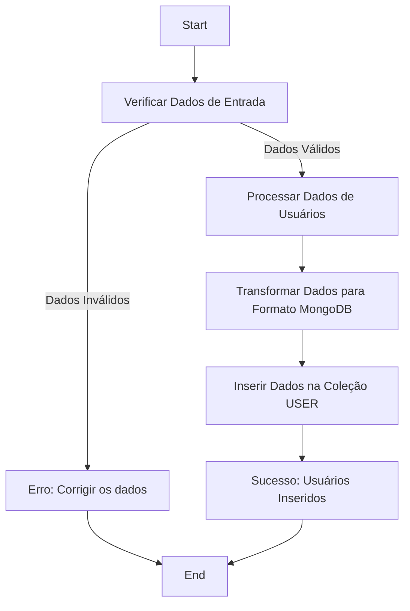
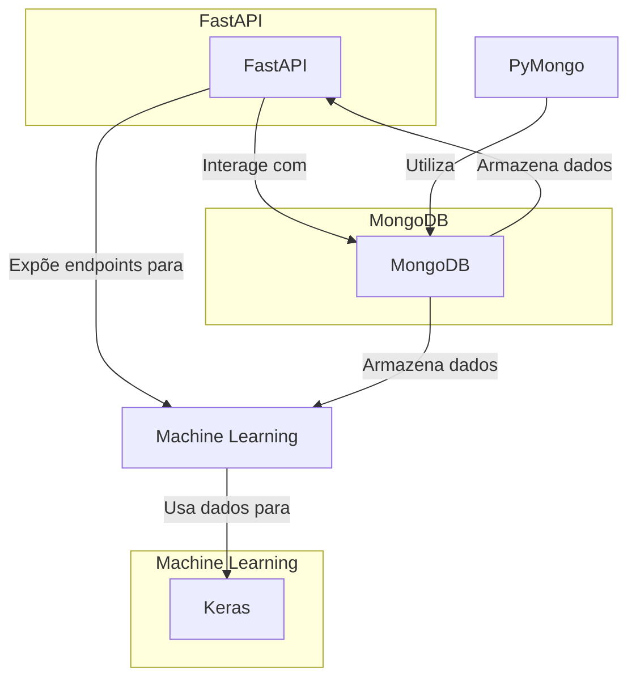
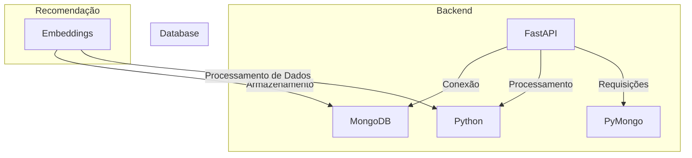

# FastInsight

### Stacks Utilizadas:

1. **FastAPI**:
   - **Função**: Framework backend de alta performance baseado em Python, ideal para o desenvolvimento de APIs RESTful.
   - **Aplicabilidade**: Utilizado para criar uma API rápida, eficiente e fácil de integrar com sistemas de aprendizado de máquina. Seu desempenho é ideal para aplicações que exigem baixa latência, como sistemas de recomendação.

2. **MongoDB**:
   - **Função**: Banco de dados NoSQL orientado a documentos (JSON-like).
   - **Aplicabilidade**: Armazena dados de usuários, itens e embeddings. Sua flexibilidade e escalabilidade são fundamentais para gerenciar grandes volumes de dados e suportar a personalização dos algoritmos de recomendação.

3. **Embeddings**:
   - **Função**: Vetores numéricos que representam características de usuários e itens.
   - **Aplicabilidade**: Utilizados para calcular similaridades e fornecer recomendações personalizadas, os embeddings são armazenados e atualizados com base em interações de usuários e itens no sistema.

4. **Pydantic**:
   - **Função**: Validação e serialização de dados através de modelos Python.
   - **Aplicabilidade**: Garantindo a consistência dos dados nas requisições e respostas da API, o Pydantic facilita a validação e manipulação dos dados de entrada e saída.

5. **PyMongo**:
   - **Função**: Biblioteca Python para operações CRUD no MongoDB.
   - **Aplicabilidade**: Permite interação direta com o banco de dados MongoDB para gerenciar usuários, itens e embeddings de forma eficiente, garantindo a persistência dos dados.

6. **Shell Script & Subprocessos**:
   - **Função**: Scripts automatizados que utilizam o terminal e o módulo `subprocess` do Python para tarefas de manutenção, backup, monitoramento e deploy da aplicação.
   - **Aplicabilidade**: Shell scripts são utilizados para automatizar tarefas como:
     - **Backup periódico de dados**: Geração automática de backups do banco de dados MongoDB, garantindo a integridade dos dados.
     - **Monitoramento de performance**: Uso de ferramentas como `htop` ou `dstat` para monitorar o desempenho do servidor e da API.
     - **Automação de deploy**: Scripts automatizados para deploy e reinicialização de serviços, reduzindo o tempo de inatividade da aplicação.
     - **Limpeza de logs e otimização**: Processos automatizados de limpeza de logs e otimização de recursos para manter a aplicação rodando de forma eficiente.

   Utilizando **subprocessos** no Python, é possível executar esses scripts diretamente a partir da aplicação, o que adiciona uma camada de automação ao sistema de recomendação, facilitando o gerenciamento e manutenção da infraestrutura.

### Possíveis Aplicabilidades:

- **Recomendações Personalizadas**: Pode ser aplicado em plataformas de e-commerce, streaming de conteúdo, ou plataformas de aprendizado para sugerir produtos, vídeos ou cursos com base nas preferências e comportamentos dos usuários.

- **Análise de Dados**: Integrado com ferramentas de análise de dados, o sistema pode fornecer insights sobre padrões de comportamento, ajudando na tomada de decisões de negócios e marketing.

- **Automação em Marketing**: Baseado nas interações do usuário, o sistema pode sugerir campanhas de marketing mais eficientes, automatizando a segmentação de público-alvo.

- **Gerenciamento e Monitoramento Automatizado**: A automação com Shell Script e subprocessos facilita o monitoramento e a manutenção do sistema, permitindo execuções programadas de backup, deploys contínuos, e otimização de performance de maneira autônoma.

# ARQUITURA DO PROJETO

## STACKS

## Relação entre as stacks:
* FastAPI: É o backend responsável por processar as requisições HTTP, gerenciar a lógica do sistema e fazer a conexão com o MongoDB usando PyMongo para CRUD.
* MongoDB: O banco de dados não relacional que armazena os usuários, embeddings, e outros dados relacionados ao sistema de recomendação.
* Python: Linguagem usada para processamento de dados e manipulação de embeddings.
* PyMongo: Biblioteca utilizada pelo FastAPI para interagir com o MongoDB.
* ShellScript: Usado para automação de tarefas e gerenciamento de subprocessos no sistema.
* Embeddings: São os dados gerados para recomendações, que são armazenados no MongoDB.
* Docker: Utilizado para gerenciar as aplicações e garantir que os serviços estejam isolados e funcionando corretamente.
